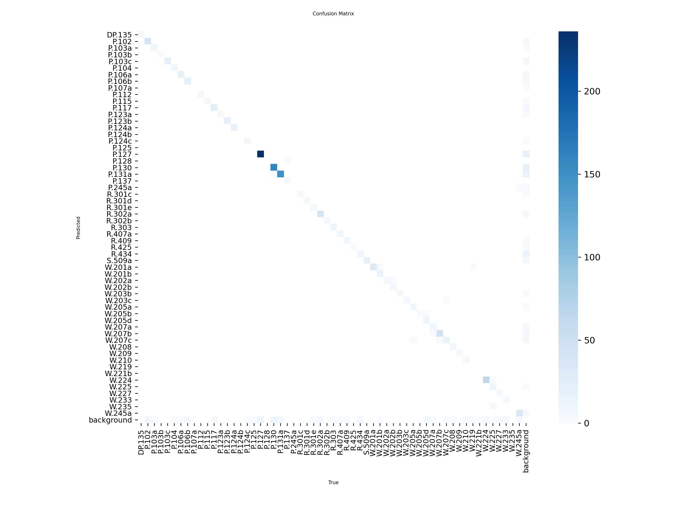
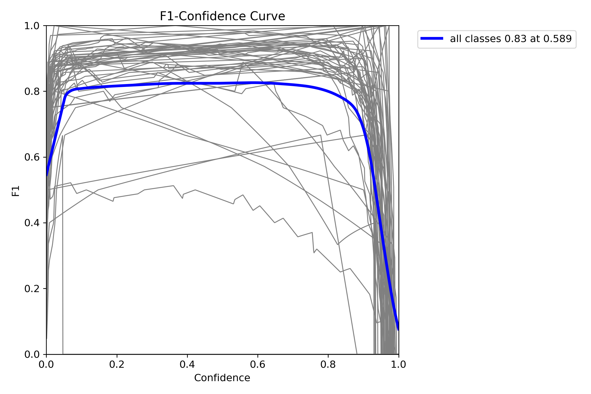
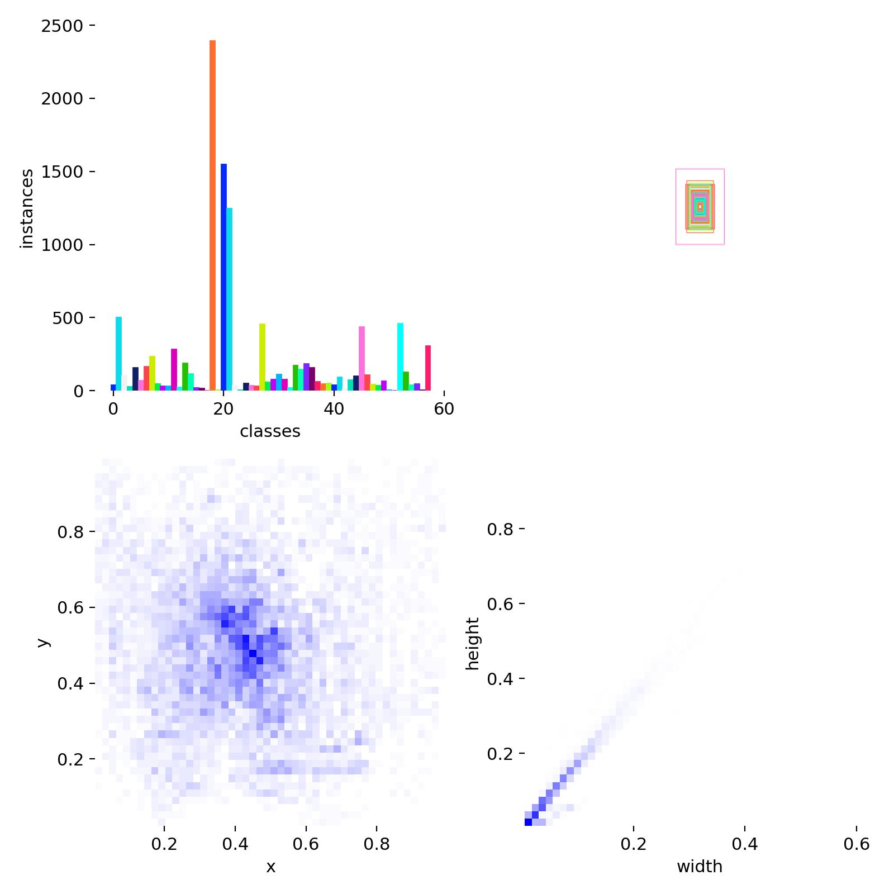
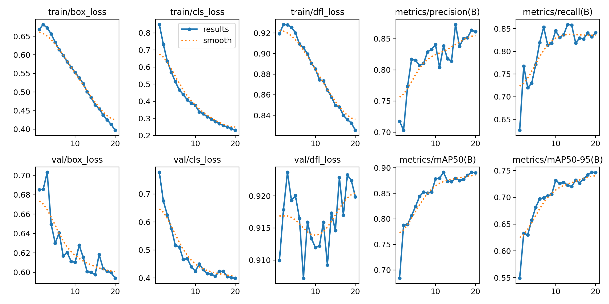
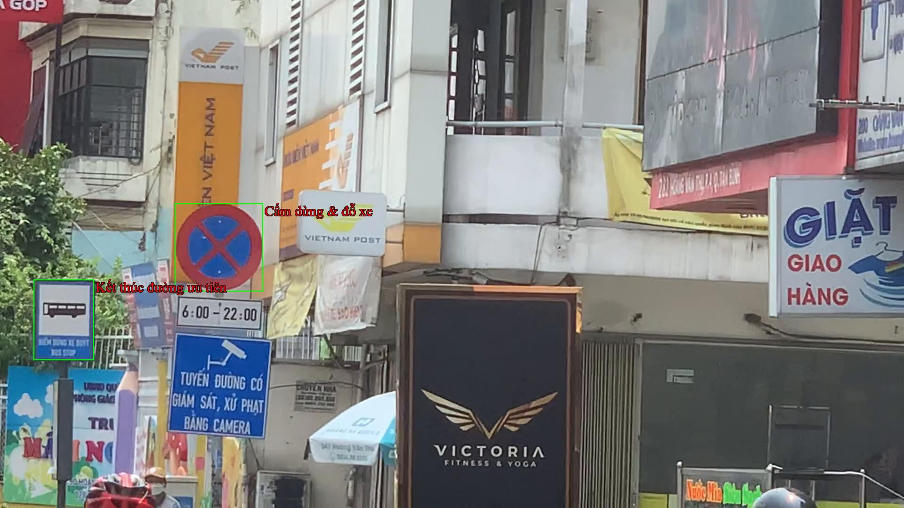

# Traffic Sign Detection - Training Report

## 1. Project Overview

This project implements an object detection model to recognize various types of traffic signs using YOLOv8 and SAHI. The main goal is to accurately detect and classify multiple classes of traffic signs in real-world images.

---

## 2. Dataset

- **Dataset:** [Tên bộ dữ liệu/nguồn thu thập, ví dụ: GTSRB, Tự thu thập, v.v.]
- **Number of classes:** [Số lượng class]
- **Total images:** [Số lượng ảnh]
- **Annotation format:** [VOC/YOLO/COCO/...]

---

## 3. Environment Setup

- **Python version:** [3.8/3.9/3.10/...]
- **Key libraries:**
  - [YOLOv8](https://github.com/ultralytics/ultralytics)
  - [SAHI](https://github.com/obss/sahi)
  - Pillow, OpenCV, Pandas, Numpy, etc.

**Install dependencies:**
```bash
pip install -r requirements.txt
```
## 4. Training Process

- **Model:** YOLOv8 
- **Epochs:** 20
- **Batch size:** 16
- **Image size:** 640x640
- **Training hardware:** GPU

---

## 5. Model Performance

### 5.1. Confusion Matrix

Shows the model’s ability to distinguish between different traffic sign classes.  
A dark diagonal means many correct predictions, while off-diagonal elements indicate confusion between classes.



---

### 5.2. F1 Score Curve

Indicates how the F1-score varies with different confidence thresholds.



---

### 5.3. Class Distribution

Number of samples per class in the dataset.

---

### 5.4. Training Metrics

Shows the evolution of loss, mAP, precision, and recall during training and validation.


---

## 6. Inference Example

---

## 7. Conclusions & Recommendations

- The model achieves high accuracy on common classes.
- Some classes with low sample counts may require data augmentation or more data collection.
- The F1 curve suggests the best confidence threshold for deployment.
- **Future work:** Test on real-world images, further hyperparameter tuning, improve small object detection, etc.

---

## 8. How to Reproduce

### 8.1. Clone the repository
```bash
git clone [repo-link]
cd [repo-folder]
```

### 8.2. Install dependencies
```bash
pip install -r requirements.txt
```


